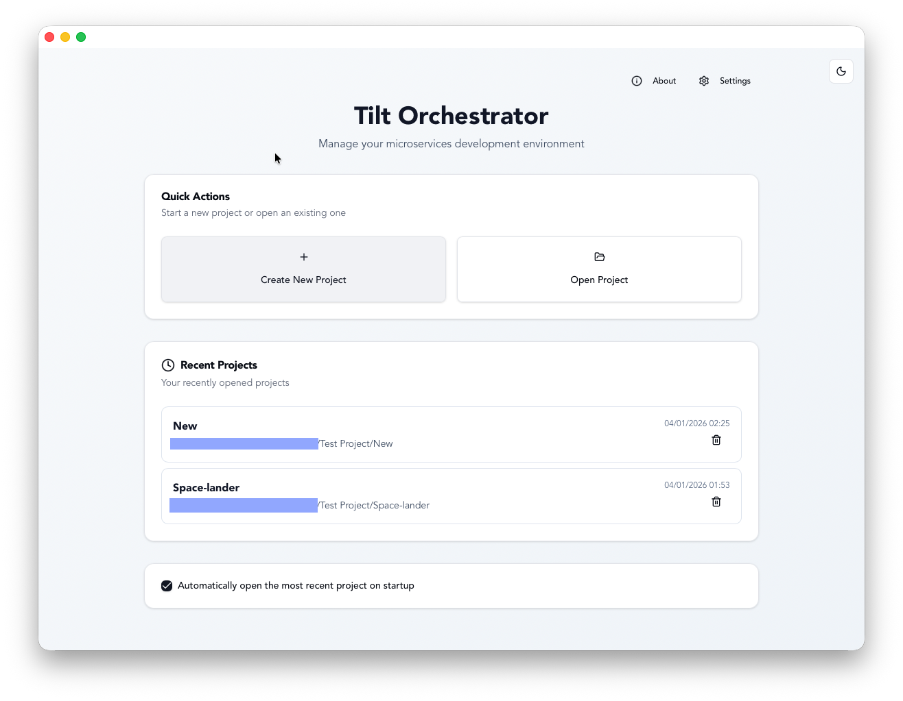
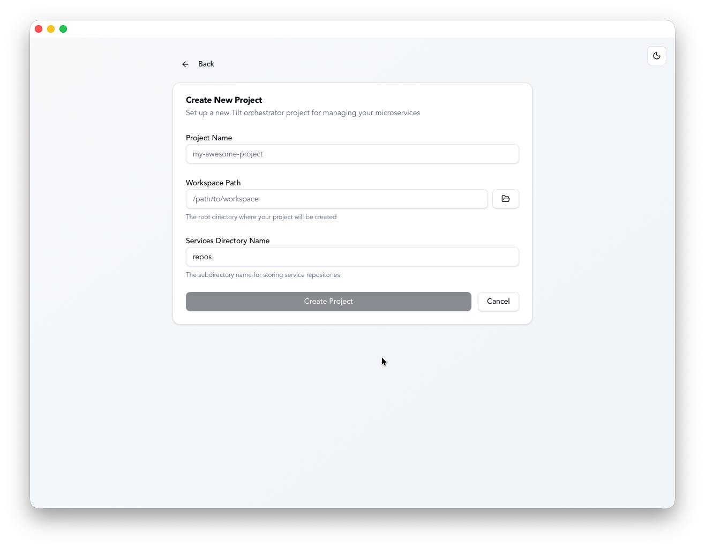
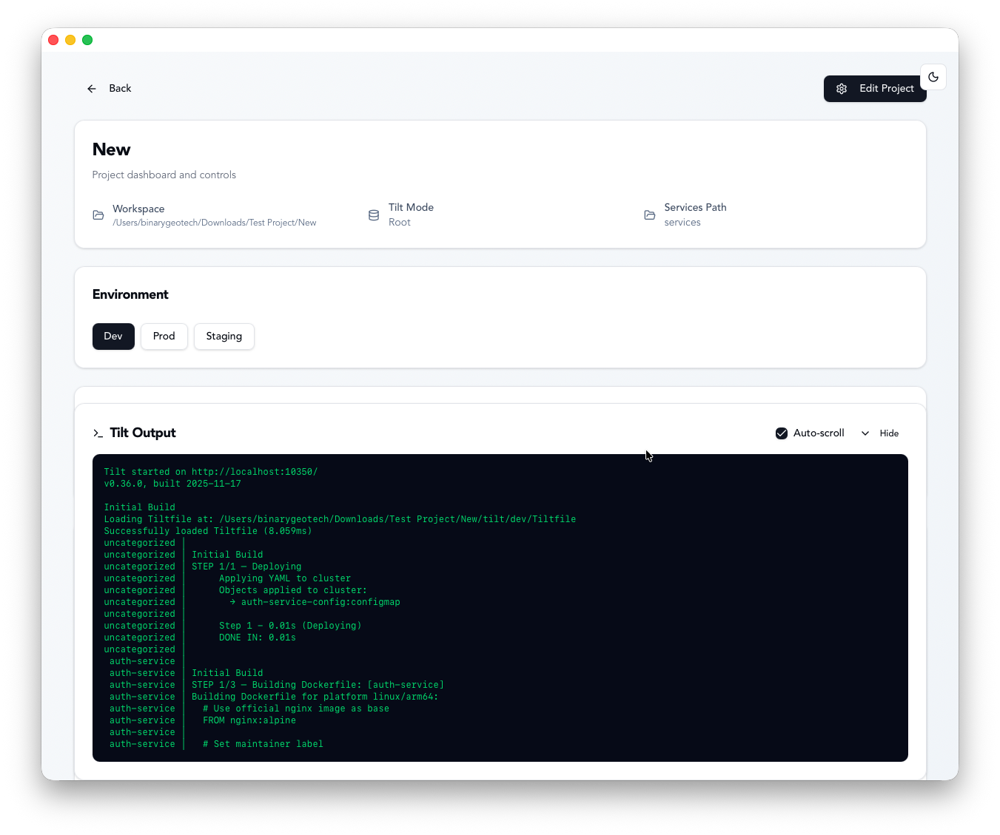
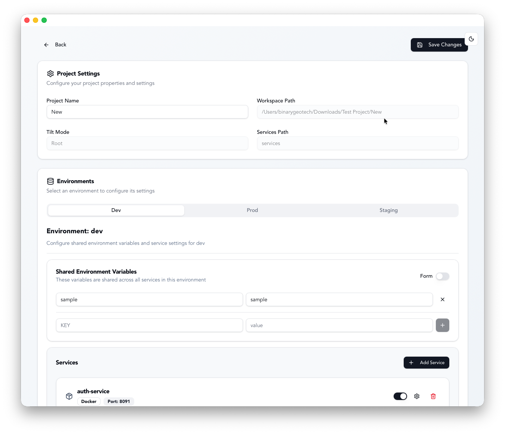
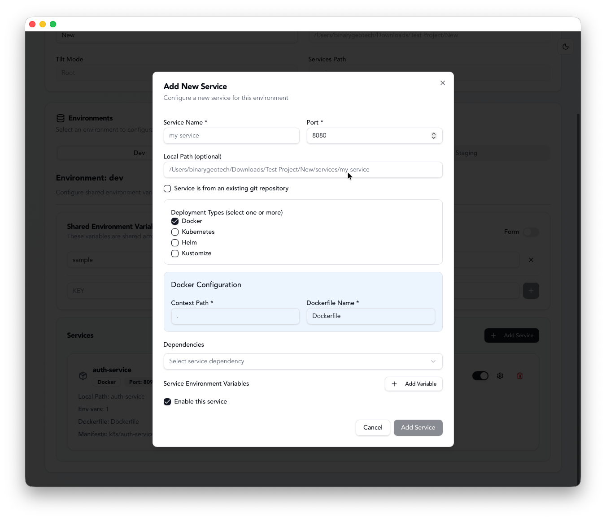
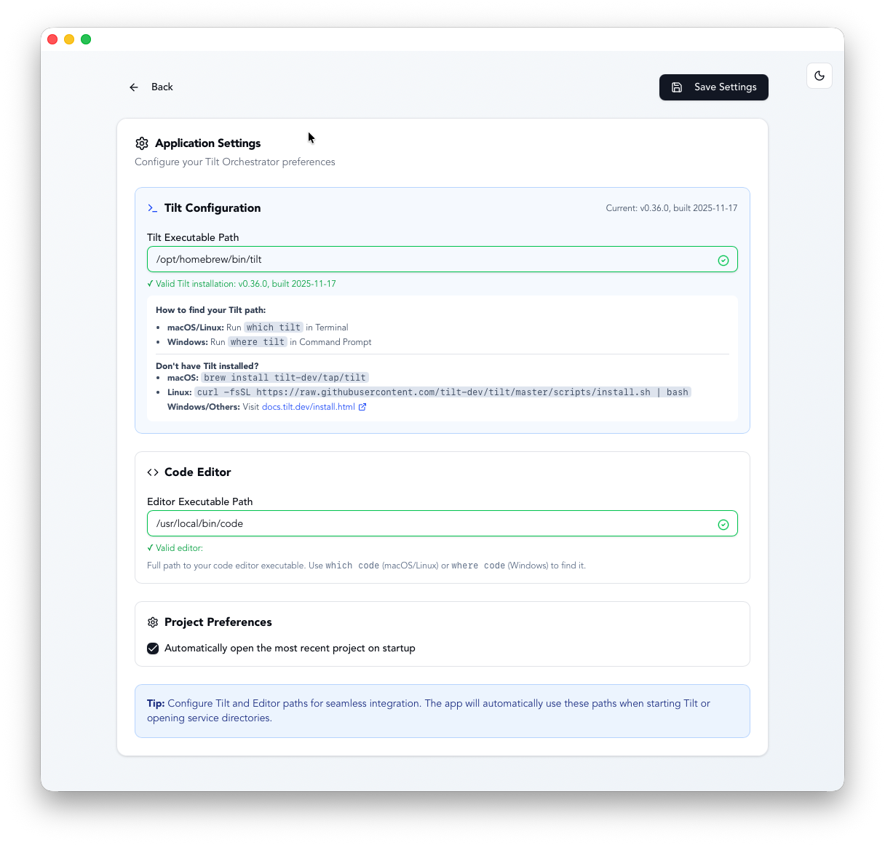

# Tilt Orchestrator

<div align="center">

**A Modern Desktop Application for Managing Microservices Development with Tilt**

[](https://tauri.app/)
[](https://reactjs.org/)
[](https://www.typescriptlang.org/)
[](https://www.rust-lang.org/)
[](https://github.com/binarygeotech/tilt-orchestrator/actions/workflows/test.yml)
[](LICENSE)

</div>

---

## 📖 Table of Contents

- [About](#about)
- [Features](#features)
- [Screenshots](#screenshots)
- [How It Works](#how-it-works)
- [Prerequisites](#prerequisites)
- [System Setup for Tilt](#system-setup-for-tilt)
- [Project Setup](#project-setup)
- [Architecture](#architecture)
- [Development](#development)
- [Testing](#testing)
- [Building](#building)
- [Contributing](#contributing)
- [License](#license)

---

## 🎯 About

Tilt Orchestrator is a cross-platform desktop application built with Tauri that simplifies the management of microservices development environments using [Tilt](https://tilt.dev/). It provides an intuitive GUI for creating, configuring, and managing multi-service projects with support for Docker, Kubernetes, Helm, and Kustomize deployments.

### Why Tilt Orchestrator?

- **Visual Project Management**: Create and manage complex microservices projects without writing Tiltfiles manually
- **Multi-Environment Support**: Easily switch between development, staging, and production configurations
- **Service Management**: Add, update, and configure services with various deployment strategies
- **Real-time Monitoring**: Built-in terminal to view Tilt logs and process output
- **Git Integration**: Clone repositories directly from the UI with branch selection
- **IDE Integration**: Open service directories in your preferred code editor

---

## ✨ Features

### Project Management
- 🆕 **Create New Projects**: Customizable workspace and services paths
- 📂 **Open Existing Projects**: Recent project history with quick access
- 🔄 **Initialize Existing Directories**: Convert any directory into a Tilt Orchestrator project
- 💾 **Auto-load Last Project**: Configurable auto-open on startup
- 📌 **System Tray Integration**: Quick access to recent projects and controls
- 🔐 **Persistent State**: Settings and preferences saved automatically

### Service Configuration
- 🐳 **Docker**: Configure context and Dockerfile paths
- ☸️ **Kubernetes**: Define manifests and resource configurations
- ⎈ **Helm**: Specify charts and namespaces
- 🔧 **Kustomize**: Set kustomization paths
- 🔗 **Multi-Deployment**: Services can use multiple deployment types simultaneously
- 📦 **Dependency Management**: Visual service dependency graph

### Environment Management
- 🌍 **Multiple Environments**: dev, staging, production with easy switching
- 🔐 **Environment Variables**: Shared and per-service configuration
- 📝 **Dual Editors**: Visual form and JSON editor for environment variables
- 📄 **Auto-generation**: `.env` files and Kubernetes ConfigMaps created automatically

### Tilt Integration
- ▶️ **Process Control**: Start/Stop/Restart Tilt with one click
- 📊 **Real-time Monitoring**: Live status updates and log streaming
- 📟 **Built-in Terminal**: View Tilt logs with auto-scroll and refresh
- 🌐 **Web UI Integration**: Direct link to Tilt's web interface
- ⚙️ **Tiltfile Generation**: Automatic generation per environment

### Configuration & Settings
- 🛠️ **Tilt Path Configuration**: Auto-detect or manually configure Tilt executable
- 📝 **Editor Integration**: Configure your preferred code editor (VS Code, IntelliJ, etc.)
- ✅ **Path Validation**: Real-time validation of executable paths with version checking
- 🎨 **Theme Support**: Dark/Light mode with system sync
- 📋 **Installation Guidance**: Built-in instructions for Tilt installation

### Development Tools
- 🌳 **Git Integration**: Clone repositories with branch selection
- 🖥️ **Quick Editor Access**: Open services directly in your configured editor
- 📋 **Template Engine**: Generate files from customizable templates
- 🔄 **Hot Reload**: Regenerate Tiltfiles on-the-fly

---

## 🏞️ Screenshots

### Landing Screen
Start here with recent projects or create a new one.



### New Project Screen
Create a new project with custom workspace configuration.



### Project View - Main
Manage your project, services, and environment variables.


### Project View - Terminal
Real-time Tilt logs and process monitoring.



### Edit Project
Update project configuration and settings.



### Add Service
Configure new services with deployment types and environment variables.



### Settings
Configure Tilt executable path and editor preferences.



### Initialize Existing Directory
Convert existing projects into Tilt Orchestrator projects.


---

## 🔄 How It Works

### Getting Started

1. **Configure Tilt**: On first launch, configure the Tilt executable path (auto-detected or manual)
2. **Create or Initialize a Project**: 
   - Create a new project from scratch, or
   - Initialize an existing directory (automatically backs up existing Tiltfiles)
3. **Add Services**: Configure services with deployment types, repository URLs, and environment variables
4. **Generate Configuration**: Tilt Orchestrator automatically generates:
   - Root Tiltfile and environment-specific Tiltfiles
   - Service-specific Tiltfiles (in each service directory)
   - Kubernetes manifests (deployments, configmaps, services)
   - Environment files (`.env` files and ConfigMaps)
5. **Start Tilt**: Launch Tilt from the UI and monitor logs in real-time
6. **Manage & Update**: Edit services, update configurations, and regenerate files as needed

### First-Time Setup

When you launch Tilt Orchestrator for the first time:
- The app checks if Tilt is installed and configured
- If not found, you'll be guided to the Settings page
- Configure your Tilt executable path (auto-detection available)
- Optionally configure your preferred code editor
- Start creating or opening projects!

### Project File Structure

When you create or initialize a project, Tilt Orchestrator generates:

```
your-project/
├── Tiltfile                          # Root Tiltfile (generated)
├── services/                         # Services directory (configurable name)
│   ├── service-a/
│   │   ├── Tiltfile                  # Service-specific Tiltfile
│   │   ├── .env.dev                  # Environment variables
│   │   ├── k8s/
│   │   │   ├── deployment.yaml       # K8s deployment
│   │   │   ├── configmap.yaml        # K8s configmap
│   │   │   └── service.yaml          # K8s service
│   │   └── ... (your service code)
│   └── service-b/
│       └── ...
├── tilt/                             # Tilt configuration per environment
│   ├── dev/
│   │   └── Tiltfile                  # Dev environment Tiltfile
│   ├── staging/
│   │   └── Tiltfile                  # Staging environment Tiltfile
│   └── prod/
│       └── Tiltfile                  # Production environment Tiltfile
├── environments/                     # Environment configurations
│   ├── dev.json
│   ├── staging.json
│   └── prod.json
└── .tooling/
    ├── project.json                  # Project metadata
    └── dev_tilt.log                  # Tilt output logs
```

**Note**: When initializing existing directories, any existing `Tiltfile` or `tilt/` directory is automatically backed up with a `.backup` extension.

---

## 📋 Prerequisites

### Required Software

- **Node.js** (v18 or higher)
- **Rust** (v1.70 or higher)
- **npm** or **yarn**
- **Git**

### Platform-Specific Requirements

#### macOS
```bash
# Install Xcode Command Line Tools
xcode-select --install

# Install Rust
curl --proto '=https' --tlsv1.2 -sSf https://sh.rustup.rs | sh
```

#### Linux
```bash
# Install dependencies (Ubuntu/Debian)
sudo apt update
sudo apt install -y libwebkit2gtk-4.1-dev \
    build-essential \
    curl \
    wget \
    file \
    libxdo-dev \
    libssl-dev \
    libayatana-appindicator3-dev \
    librsvg2-dev

# Install Rust
curl --proto '=https' --tlsv1.2 -sSf https://sh.rustup.rs | sh
```

#### Windows
```powershell
# Install Visual Studio C++ Build Tools
# Download from: https://visualstudio.microsoft.com/visual-cpp-build-tools/

# Install Rust
# Download from: https://rustup.rs/
```

---

## 🚀 System Setup for Tilt

Tilt Orchestrator requires Tilt to be installed on your system.

### Installing Tilt

#### macOS
```bash
# Using Homebrew
brew install tilt-dev/tap/tilt
```

#### Linux
```bash
curl -fsSL https://raw.githubusercontent.com/tilt-dev/tilt/master/scripts/install.sh | bash
```

#### Windows
```powershell
# Using Scoop
scoop bucket add tilt-dev https://github.com/tilt-dev/scoop-bucket
scoop install tilt
```

### Installing Docker Desktop

Tilt requires Docker or a Kubernetes cluster.

- **Docker Desktop**: [Download here](https://www.docker.com/products/docker-desktop)
- Enable Kubernetes in Docker Desktop settings (recommended for local development)

### Verify Installation

```bash
# Check Tilt version
tilt version

# Check Docker
docker --version

# Check Kubernetes (if using Docker Desktop)
kubectl version --client
```

### Optional: Configure Kubernetes Context

```bash
# List available contexts
kubectl config get-contexts

# Use Docker Desktop Kubernetes
kubectl config use-context docker-desktop
```

---

## 🛠️ Project Setup

### 1. Clone the Repository

```bash
git clone https://github.com/yourusername/tilt-orchestrator.git
cd tilt-orchestrator/tilt-orchestrator
```

### 2. Install Dependencies

```bash
# Install frontend dependencies
npm install

# Install Rust dependencies (handled automatically by Cargo)
cd src-tauri
cargo fetch
cd ..
```

### 3. Environment Configuration

No additional environment configuration is required. The application uses local storage for preferences.

---

## 🏗️ Architecture

### Technology Stack

- **Frontend**: React 18 + TypeScript + Vite
- **UI Framework**: Shadcn/ui + Tailwind CSS
- **Backend**: Rust + Tauri 2.0
- **State Management**: React Context API
- **Styling**: Tailwind CSS v4 with OKLCH colors

### Project Structure

```
tilt-orchestrator/
├── src/                              # Frontend source code
│   ├── components/                   # React components
│   │   ├── AddServiceDialog.tsx      # Service creation/editing
│   │   ├── ConfigureExistingProject.tsx # Initialize existing directory
│   │   ├── CreateProjectForm.tsx     # Project creation form
│   │   ├── LandingScreen.tsx         # Home screen with recent projects
│   │   ├── ProjectView.tsx           # Project dashboard
│   │   ├── ProjectManagement.tsx     # Project editor
│   │   ├── ServiceCard.tsx           # Service display
│   │   ├── Settings.tsx              # App settings (Tilt & Editor config)
│   │   ├── ThemeProvider.tsx         # Theme management
│   │   ├── TiltControls.tsx          # Tilt process controls
│   │   └── ui/                       # Shadcn/ui components
│   ├── providers/                    # Context providers
│   │   ├── AppStateProvider.tsx      # Application state
│   │   └── TrayIconProvider.tsx      # System tray integration
│   ├── types/                        # TypeScript types
│   ├── api/                          # Tauri IPC API
│   │   └── api.ts                    # API functions
│   ├── tests/                        # Frontend tests
│   │   ├── api.test.ts               # API tests
│   │   └── components/               # Component tests
│   ├── App.tsx                       # Root component
│   └── main.tsx                      # Entry point
│
├── src-tauri/                        # Backend source code
│   ├── src/
│   │   ├── app_state/                # Application state
│   │   │   ├── model.rs              # State models (preferences, recent projects)
│   │   │   ├── store.rs              # State persistence
│   │   │   └── mod.rs
│   │   ├── backend/                  # Core backend logic
│   │   │   ├── generator.rs          # Tiltfile generation
│   │   │   ├── git.rs                # Git operations
│   │   │   ├── ipc.rs                # IPC command handlers
│   │   │   ├── tilt_manager.rs       # Tilt process management
│   │   │   ├── project_manager.rs    # Project CRUD operations
│   │   │   ├── dependency_graph.rs   # Service dependencies
│   │   │   ├── ports.rs              # Port management
│   │   │   ├── errors.rs             # Error types
│   │   │   └── mod.rs
│   │   ├── project/                  # Project operations
│   │   │   └── mod.rs                # Create, open, initialize projects
│   │   ├── lib.rs                    # Library entry
│   │   └── main.rs                   # Application entry
│   ├── Cargo.toml                    # Rust dependencies
│   ├── tauri.conf.json               # Tauri configuration
│   └── capabilities/                 # Security permissions
│       └── default.json              # Shell command permissions
│
├── docs/                             # Documentation
│   ├── ADD_EXISTING_PROJECT_FEATURE.md
│   ├── TILT_INSTALLATION_CHECK.md
│   ├── TILT_EDITOR_PATH_CONFIGURATION.md
│   └── README_TESTS.md
│
├── screenshots/                      # Application screenshots
├── .github/                          # GitHub workflows and templates
├── package.json                      # Node dependencies
├── tsconfig.json                     # TypeScript config
├── tailwind.config.js                # Tailwind config
├── vite.config.ts                    # Vite config
├── vitest.config.ts                  # Vitest config
├── README.md                         # This file
└── CHANGELOG.md                      # Version history
```

### Backend Architecture

```
┌─────────────────┐
│   Tauri IPC     │
└────────┬────────┘
         │
         ▼
┌─────────────────┐
│  IPC Handlers   │
│  (commands/)    │
└────────┬────────┘
         │
         ▼
┌─────────────────┐     ┌──────────────────┐
│ Project Manager │────▶│  State Manager   │
│   (project/)    │     │  (app_state/)    │
└────────┬────────┘     └──────────────────┘
         │
         ▼
┌─────────────────┐     ┌──────────────────┐
│   Generator     │────▶│   Git Manager    │
│  (generator.rs) │     │    (git.rs)      │
└─────────────────┘     └──────────────────┘
         │
         ▼
┌─────────────────┐
│  Tilt Manager   │
│(tilt_manager.rs)│
└─────────────────┘
```

### Frontend Architecture

```
┌─────────────────────┐
│      App.tsx        │
│  (Route Management) │
└──────────┬──────────┘
           │
    ┌──────┴──────┐
    │             │
    ▼             ▼
┌─────────┐  ┌──────────────┐
│ Landing │  │ ProjectView  │
│ Screen  │  │/Management   │
└─────────┘  └──────┬───────┘
                    │
              ┌─────┴─────┐
              │           │
              ▼           ▼
         ┌─────────┐ ┌────────┐
         │ Service │ │  Tilt  │
         │  Card   │ │Controls│
         └─────────┘ └────────┘
```

---

## 💻 Development

### Running in Development Mode

```bash
# Start development server
npm run tauri dev
```

This will:
1. Start the Vite dev server
2. Compile the Rust backend
3. Launch the Tauri application with hot-reload

### Code Formatting

```bash
# Format frontend code
npm run format

# Format backend code
cd src-tauri
cargo fmt
```

### Linting

```bash
# Lint frontend
npm run lint

# Lint backend
cd src-tauri
cargo clippy
```

---

## 🧪 Testing

### Frontend Tests

Uses Vitest + React Testing Library.

```bash
# Run tests
npm test

# Run tests with UI
npm run test:ui

# Run tests with coverage
npm run test:coverage

# Watch mode
npm run test:watch
```

### Backend Tests

Uses Rust's built-in test framework.

```bash
cd src-tauri

# Run all tests
cargo test

# Run tests with output
cargo test -- --nocapture

# Run specific test
cargo test test_render_template

# Run tests with coverage (requires tarpaulin)
cargo install cargo-tarpaulin
cargo tarpaulin --out Html
```

### Test Coverage

Frontend tests cover:
- API functions (IPC calls)
- Component rendering and user interactions
- State management and context providers
- Theme switching and tray integration

Backend tests cover:
- Template rendering and Tiltfile generation
- Kubernetes manifest creation
- Project CRUD operations (create, open, initialize)
- Tilt process management (start, stop, restart)
- Path validation and configuration
- Git operations and repository cloning

See [docs/README_TESTS.md](docs/README_TESTS.md) for detailed testing documentation.

---

## 📦 Building

### Development Build

```bash
npm run tauri build
```

This creates an optimized build in `src-tauri/target/release/`.

### Platform-Specific Builds

#### macOS

```bash
# Universal binary (Intel + Apple Silicon)
npm run tauri build -- --target universal-apple-darwin

# Intel only
npm run tauri build -- --target x86_64-apple-darwin

# Apple Silicon only
npm run tauri build -- --target aarch64-apple-darwin
```

Output: `.dmg` and `.app` in `src-tauri/target/release/bundle/`

#### Linux

```bash
# Build for current architecture
npm run tauri build

# Debian package
npm run tauri build -- --bundles deb

# AppImage
npm run tauri build -- --bundles appimage
```

Output: `.deb`, `.AppImage` in `src-tauri/target/release/bundle/`

#### Windows

```bash
# MSI installer
npm run tauri build -- --bundles msi

# NSIS installer
npm run tauri build -- --bundles nsis
```

Output: `.msi`, `.exe` in `src-tauri/target/release/bundle/`

### Build Configuration

Edit `src-tauri/tauri.conf.json` to configure:
- Application name and version
- Window properties
- Bundle identifier
- Icons
- Permissions

---

## 🤝 Contributing

We welcome contributions! Please follow these guidelines:

### Getting Started

1. Fork the repository
2. Create a feature branch: `git checkout -b feature/amazing-feature`
3. Make your changes
4. Run tests: `npm test && cd src-tauri && cargo test`
5. Commit with conventional commits: `git commit -m 'feat: add amazing feature'`
6. Push to your fork: `git push origin feature/amazing-feature`
7. Open a Pull Request

### Commit Convention

We follow [Conventional Commits](https://www.conventionalcommits.org/):

- `feat:` New feature
- `fix:` Bug fix
- `docs:` Documentation changes
- `style:` Code style changes (formatting)
- `refactor:` Code refactoring
- `test:` Test additions or changes
- `chore:` Build process or tooling changes

### Code Style

**Frontend:**
- Use TypeScript strict mode
- Follow React best practices
- Use functional components with hooks
- Add JSDoc comments for complex functions

**Backend:**
- Follow Rust style guide (rustfmt)
- Add documentation comments (`///`)
- Handle errors with `Result<T, E>`
- Write unit tests for new functions
- Run `cargo fmt --check` to check formatting and `cargo fmt` to auto-fix
- Run `cargo clippy -- -D warnings` to check for any mistake and improve your Rust code
- Run `cargo clippy --fix --lib -p tilt-orchestrator` to auto-fix code mistake(s)

### Pull Request Process

1. Update documentation if needed
2. Add tests for new features
3. Ensure all tests pass
4. Update CHANGELOG.md
5. Request review from maintainers

### Reporting Issues

Use GitHub Issues and include:
- Clear description of the problem
- Steps to reproduce
- Expected vs actual behavior
- System information (OS, versions)
- Screenshots if applicable

---

## 📄 License

This project is licensed under the MIT License - see the LICENSE file for details.

```
MIT License

Copyright (c) 2026 Tilt Orchestrator Contributors

Permission is hereby granted, free of charge, to any person obtaining a copy
of this software and associated documentation files (the "Software"), to deal
in the Software without restriction, including without limitation the rights
to use, copy, modify, merge, publish, distribute, sublicense, and/or sell
copies of the Software, and to permit persons to whom the Software is
furnished to do so, subject to the following conditions:

The above copyright notice and this permission notice shall be included in all
copies or substantial portions of the Software.

THE SOFTWARE IS PROVIDED "AS IS", WITHOUT WARRANTY OF ANY KIND, EXPRESS OR
IMPLIED, INCLUDING BUT NOT LIMITED TO THE WARRANTIES OF MERCHANTABILITY,
FITNESS FOR A PARTICULAR PURPOSE AND NONINFRINGEMENT. IN NO EVENT SHALL THE
AUTHORS OR COPYRIGHT HOLDERS BE LIABLE FOR ANY CLAIM, DAMAGES OR OTHER
LIABILITY, WHETHER IN AN ACTION OF CONTRACT, TORT OR OTHERWISE, ARISING FROM,
OUT OF OR IN CONNECTION WITH THE SOFTWARE OR THE USE OR OTHER DEALINGS IN THE
SOFTWARE.
```

---

## 🙏 Acknowledgments

- [Tilt](https://tilt.dev/) - For the amazing microservices development tool
- [Tauri](https://tauri.app/) - For the lightweight desktop app framework
- [Shadcn/ui](https://ui.shadcn.com/) - For the beautiful UI components
- All contributors who help improve this project

---

## 📞 Support

- 📖 **Feature Documentation**: See [docs/](docs/) directory for detailed guides
  - [Initialize Existing Projects](docs/ADD_EXISTING_PROJECT_FEATURE.md)
  - [Tilt Configuration](docs/TILT_INSTALLATION_CHECK.md)
  - [Editor Integration](docs/TILT_EDITOR_PATH_CONFIGURATION.md)
- 🐛 **Bug Reports**: [GitHub Issues](https://github.com/binarygeotech/tilt-orchestrator/issues)
- 💬 **Discussions**: [GitHub Discussions](https://github.com/binarygeotech/tilt-orchestrator/discussions)
- 📋 **Tests**: [Testing Documentation](docs/README_TESTS.md)

---

<div align="center">

Made with ❤️ by the Tilt Orchestrator team

[⬆ Back to Top](#tilt-orchestrator)

</div>