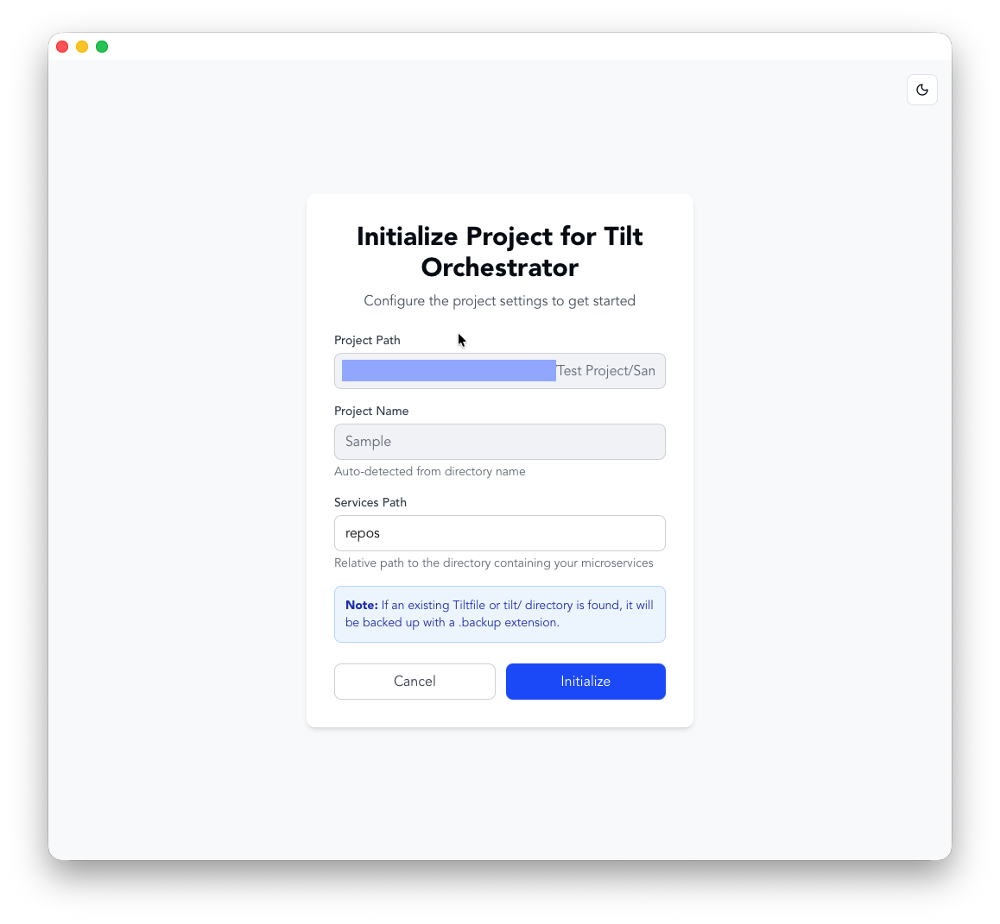

# Add Existing Project Feature

## Overview
This feature allows users to initialize any directory as a Tilt Orchestrator project, even if it wasn't originally created by the application. When a user attempts to open a directory that doesn't contain a `project.json` file, they are prompted to initialize it for Tilt Orchestrator.



## User Flow

1. **User attempts to open a directory** (via LandingScreen → Browse)
2. **App detects it's not a valid TO project** (no `project.json`)
3. **Ask dialog appears**: "This directory is not a valid Tilt Orchestrator project. Would you like to initialize it for Tilt Orchestrator?"
4. **User clicks "Yes"**: Configuration screen appears
5. **Configuration screen shows**:
   - Project Path (read-only, from selected directory)
   - Project Name (read-only, auto-detected from directory name)
   - Services Path (editable, defaults to "repos")
6. **User clicks "Initialize"**:
   - Existing `Tiltfile` → renamed to `Tiltfile.backup`
   - Existing `tilt/` directory → renamed to `tilt.backup`
   - Creates directory structure:
     - `<services_path>/` (as specified by user)
     - `tilt/`
     - `.tooling/`
     - `environments/`
   - Creates default environments: `dev`, `staging`, `prod`
   - Writes `project.json` with project metadata
   - Generates Tiltfiles for all environments
7. **Project opens** in the main project view

## Implementation Details

### Backend (Rust)

#### src-tauri/src/project/mod.rs
- **`is_valid_project(path: &str) -> bool`**
  - Checks if `project.json` exists at the given path
  - Returns `true` if valid, `false` otherwise

- **`initialize_existing_project(path: &str, services_path: &str) -> Result<Project, AppError>`**
  - Extracts project name from directory name
  - Backs up existing Tiltfile to `Tiltfile.backup`
  - Backs up existing `tilt/` directory to `tilt.backup`
  - Creates necessary directory structure
  - Creates default environments (dev, staging, prod)
  - Writes `project.json` with ProjectInfo
  - Generates Tiltfiles for all environments
  - Returns initialized Project

#### src-tauri/src/backend/ipc.rs
- **`isValidProject` command**
  - Input: `{ path: String }`
  - Output: `{ "valid": bool }`
  
- **`initializeExistingProject` command**
  - Input: `{ path: String, services_path: String }`
  - Output: `Project` (JSON)

### Frontend (React/TypeScript)

#### src/api/api.ts
- **`isValidProject(path: string): Promise<{ valid: boolean }>`**
  - Calls backend `isValidProject` command
  
- **`initializeExistingProject(path: string, servicesPath: string): Promise<Project>`**
  - Calls backend `initializeExistingProject` command

#### src/components/ConfigureExistingProject.tsx
New component that displays the configuration screen with:
- Project path (read-only)
- Project name (auto-detected, read-only)
- Services path (editable input)
- Initialize and Cancel buttons
- Loading state during initialization
- Error handling and display
- Information note about backup behavior

#### src/App.tsx
- Added new screen type: `"configure-existing-project"`
- Added state: `pendingProjectPath` to track project being initialized
- Updated `handleOpenProject()`:
  - Calls `isValidProject()` before opening
  - Shows ask dialog if not valid
  - Navigates to configuration screen if user accepts
- Added `handleExistingProjectInitialized()`:
  - Sets current project after successful initialization
  - Navigates to project view
- Added `handleCancelInitialization()`:
  - Returns to landing screen if user cancels

## Files Modified

1. **Backend**:
   - `src-tauri/src/project/mod.rs` - Added validation and initialization functions
   - `src-tauri/src/backend/ipc.rs` - Added IPC command handlers

2. **Frontend**:
   - `src/api/api.ts` - Added API functions for validation and initialization
   - `src/components/ConfigureExistingProject.tsx` - New configuration UI component
   - `src/App.tsx` - Integrated new flow and screen navigation

## Testing

- ✅ TypeScript compiles without errors
- ✅ Rust backend compiles without errors
- ✅ Frontend builds successfully
- ✅ 26/27 tests passing (1 pre-existing failure unrelated to this feature)

## Usage Example

```bash
# User opens a directory that contains:
/my-project
  ├── src/
  ├── Tiltfile         # Will be backed up
  ├── tilt/            # Will be backed up
  └── some-code.js

# After initialization, directory structure becomes:
/my-project
  ├── src/
  ├── Tiltfile.backup  # Original backed up
  ├── tilt.backup/     # Original backed up
  ├── project.json     # New TO metadata
  ├── repos/           # New services directory
  ├── tilt/            # New TO tilt files
  │   ├── dev/
  │   ├── staging/
  │   └── prod/
  ├── .tooling/
  ├── environments/
  │   ├── dev.json
  │   ├── staging.json
  │   └── prod.json
  └── some-code.js
```

## Edge Cases Handled

1. **Existing Tiltfile**: Backed up to `Tiltfile.backup`
2. **Existing tilt/ directory**: Backed up to `tilt.backup`
3. **Invalid path**: Error displayed to user
4. **Empty services path**: Validation error shown
5. **User cancels**: Returns to landing screen without modifications
6. **Initialization failure**: Error message displayed with details

## Future Enhancements

- [ ] Add option to customize environment names
- [ ] Support importing existing Tiltfile configuration
- [ ] Add preview of changes before initialization
- [ ] Allow setting TiltMode during initialization
- [ ] Batch initialization for multiple projects
